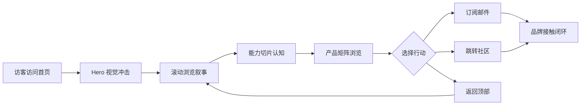

## 1. 产品概述

OwlByte Home 是 OwlByte 品牌的官方首页，承载品牌叙事、产品理念传达与社区入口三大职能。它面向开发者、技术爱好者与潜在合作伙伴，以"夜行观察者"的隐喻传达"在数据洪流中洞察本质"的品牌精神，目标是建立 OwlByte 作为"冷静、深邃、可信"的技术品牌认知。

- 核心目的：以沉浸式视觉与精炼叙事传递 OwlByte 品牌精神，引导访客了解品牌哲学、产品矩阵与社区动态
- 目标用户：开发者、技术决策者、设计工程师、对精致技术品牌敏感的早期采用者
- 市场价值：以高识别度的视觉语言在工具同质化的技术赛道中建立差异化品牌资产，提升潜在用户的记忆点与回访率

## 2. 核心功能

### 2.1 用户角色

| 角色 | 注册方式 | 核心权限 |
|------|----------|----------|
| 访客 | 无需注册 | 浏览全部品牌内容、查看产品入口、跳转社区 |
| 社区成员 | 邮箱订阅 | 接收品牌动态、加入社区入口 |

### 2.2 功能模块

1. **首页（Home）**：全屏沉浸式 Hero、品牌叙事、能力切片、产品矩阵、社区入口、页脚信息

### 2.3 页面详情

| 页面名称 | 模块名称 | 功能描述 |
|----------|----------|----------|
| 首页 | Hero 区 | 全屏背景图叠加品牌主视觉，主标题、副标题、双 CTA 按钮、滚动指示器 |
| 首页 | 顶部导航 | 玻璃拟态固定导航：Logo、菜单项、主题切换、订阅按钮 |
| 首页 | 品牌叙事 | "夜行观察者"宣言区：大字号引言 + 滚动渐入的哲学陈述 |
| 首页 | 能力切片 | 三栏能力展示（洞察 / 精度 / 守护），每项配图标与描述 |
| 首页 | 产品矩阵 | 卡片式产品入口，hover 触发微交互，每张卡含产品图、名称、简介、跳转链接 |
| 首页 | 社区入口 | 邮箱订阅表单 + 社交链接聚合，含提交成功反馈 |
| 首页 | 页脚 | 品牌信息、链接列、版权声明、回到顶部按钮 |

## 3. 核心流程

访客进入首页 → 浏览 Hero 视觉冲击 → 滚动触发品牌叙事渐入 → 查看能力切片建立认知 → 浏览产品矩阵寻找入口 → 选择订阅或跳转社区 → 完成品牌接触闭环。

## 4. 用户界面设计

### 4.1 设计风格

**美学方向：夜行精密工坊（Nocturnal Atelier）**
- 主色：深夜墨蓝 `#0A0E1A`（基底）、`#121829`（次级背景）
- 强调色：琥珀金 `#E8B65A`（猫头鹰之眼）、月光青 `#5FB8A8`（次级强调）
- 文本：羊皮纸白 `#F4EAD5`（主）、`#9AA3B8`（次级）
- 按钮风格：主按钮为琥珀金实心带微妙内阴影；次按钮为透明描边玻璃拟态
- 字体：标题使用 `Fraunces`（可变衬线，呼应智慧/学者气质），正文使用 `Manrope`，技术性文本使用 `JetBrains Mono`
- 布局：桌面优先的非对称编辑式布局，重叠与错位，留白与密度交替
- 装饰：噪点纹理叠加、几何猫头鹰眼图样、二进制扫描线、月光径向渐晕

### 4.2 页面设计概览

| 页面名称 | 模块名称 | UI 元素 |
|----------|----------|----------|
| 首页 | Hero 区 | 全屏背景图 + 暗色径向渐变叠加、超大可变衬线标题、双 CTA、自定义滚动指示器、首屏入场动画（标题字符逐字 stagger） |
| 首页 | 顶部导航 | 玻璃拟态固定栏、Logo 自绘 SVG、菜单 hover 下划线动画、右侧订阅按钮带光晕 |
| 首页 | 品牌叙事 | 超大字号引言、滚动触发字符渐入、左右错位引文、装饰性引号 SVG |
| 首页 | 能力切片 | 三列卡片，每张含自绘几何图标、标题、描述，hover 时图标旋转 + 卡片浮起 |
| 首页 | 产品矩阵 | 非对称网格产品卡，hover 触发图片缩放与遮罩渐变，含箭头微动效 |
| 首页 | 社区入口 | 邮箱表单内嵌发光描边、提交后 toast 反馈、社交图标圆形聚合 |
| 首页 | 页脚 | 多列链接、Logo 复现、回到顶部按钮带圆形进度环 |

### 4.3 响应式

- 桌面优先（≥1280px）：完整非对称布局、自定义光标、视差效果全开
- 平板（768-1279px）：能力切片保持三栏，产品矩阵降为两栏，导航折叠为汉堡菜单
- 移动（<768px）：单列堆叠，导航全屏抽屉，Hero 字号自适应 clamp，禁用自定义光标与重动画
- 触摸优化：所有可交互区域最小点击区 44px，hover 效果降级为 active 态

### 4.4 装饰与动效

- 全局噪点叠加层（SVG feTurbulence）增强质感
- 鼠标跟随光晕（桌面端）
- Hero 标题字符逐字入场（animation-delay stagger）
- 滚动触发渐入（IntersectionObserver）
- 数字滚动计数器（社区成员数等指标）
- 自定义 SVG 猫头鹰几何 Logo
