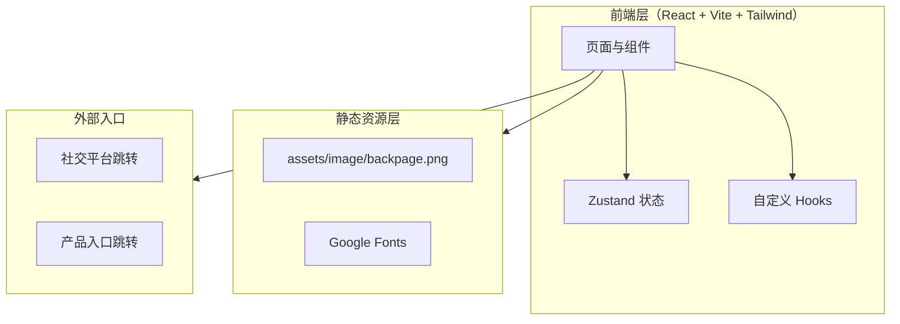
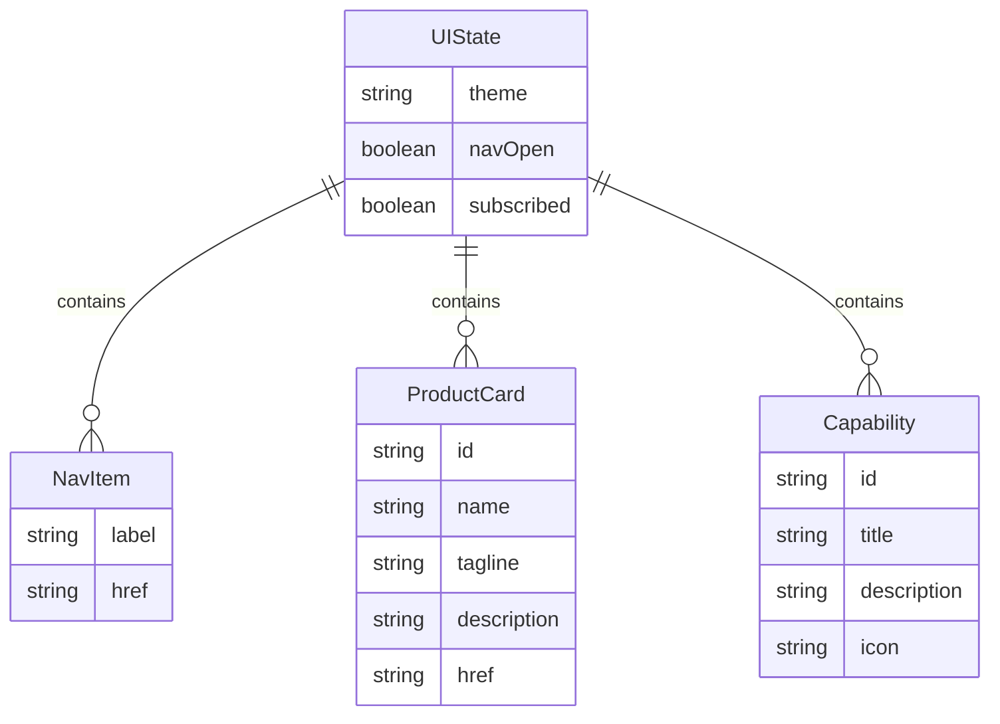

## 1. 架构设计



## 2. 技术选型

- 前端：React@18 + tailwindcss@3 + vite
- 初始化工具：vite-init
- 后端：无（纯前端品牌首页）
- 数据：无后端数据库，订阅表单前端校验 + 模拟提交反馈
- 状态管理：zustand（用于导航抽屉开合、主题切换等本地 UI 状态）
- 路由：react-router-dom（仅 / 单页，但保留路由结构以便扩展）
- 字体：Google Fonts（Fraunces / Manrope / JetBrains Mono）

## 3. 路由定义

| 路由 | 用途 |
|------|------|
| `/` | OwlByte Home 首页，承载全部品牌内容 |

## 4. API 定义

无后端 API。订阅表单采用前端模拟提交：表单校验通过后，本地状态切换为"已提交"，显示成功 toast，1.5s 后恢复。

## 5. 服务器架构图

不适用（纯前端项目）。

## 6. 数据模型

### 6.1 数据模型定义

无持久化数据。仅以下内存态：



### 6.2 数据定义语言

不适用（无数据库）。以下为前端常量数据结构示例：

```ts
// 静态品牌常量，直接内嵌于组件或 utils 中
const PRODUCTS = [
  { id: 'observatory', name: 'Observatory', tagline: '数据观测台', description: '...', href: '#' },
  // ...
] as const
```
